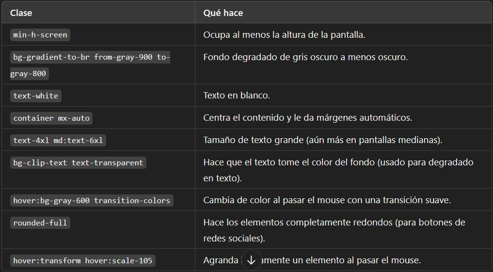

# Portfolio
Follow me to build my portfolio.
##
A simple portfolio using vite, react and Tailwindcss
## table of tailwindcss that I use in the code


```sh
Este código usa Tailwind CSS para aplicar estilos de forma rápida y reutilizable. Se centra en:

-Diseño responsivo con tamaños que cambian según el dispositivo.

-Animaciones y efectos al pasar el mouse.

-Flexbox y Grid para alinear elementos.

-Gradientes y colores modernos para mejorar la apariencia visual.
```

